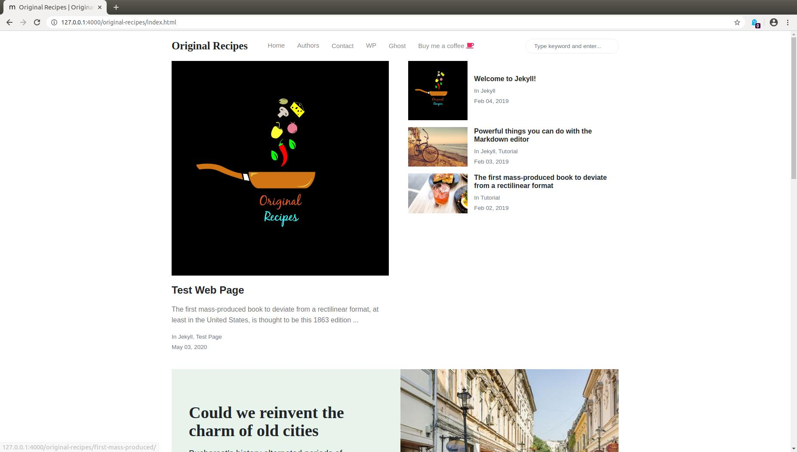

# Original Recipes - Your all stop site for cooking recipes 

### Documentation

[How to install & use]

### Contribute to Original Recipes

1. In the top-right corner of this page, click **Fork**.

2. Clone a copy of your fork on your local, replacing *YOUR-USERNAME* with your BitBucket username.

   `git clone git@bitbucket.org:YOUR-USERNAME/original-recipes.git`

3. **Create a branch**: 

   `git checkout -b <my-new-feature-or-fix>`

4. **Make necessary changes and commit those changes**:

   `git add .`

   `git commit -m "new feature or fix"`

5. **Push changes**, replacing `<add-your-branch-name>` with the name of the branch you created earlier at step #3. :

   `git push origin <add-your-branch-name>`

6. Submit your changes for review. Go to your repository on BitBuket, you'll see a **Compare & pull request** button. Click on that button. Now submit the pull request.

That's it! Soon I'll be merging your changes into the master branch of this project. You will get a notification email once the changes have been merged. Thank you for your contribution.

### Jekyll Installation Instructions

1. Install a full [Ruby development environment](https://jekyllrb.com/docs/installation/)

2. Install Jekyll and bundler gems. 
    `gem install jekyll bundler`

### Build the Website on local server

1. Go to the project directory which is cloned in step#2 and run bundle gems on local server
    
    `bundle`
    
2. Build the site and make it available on a local server.

    `bundle exec jekyll serve --watch`    

3. Browse to http://localhost:4000
 
 For further instructions and troubleshooting visit [Jekyll docs](https://jekyllrb.com/docs/)

